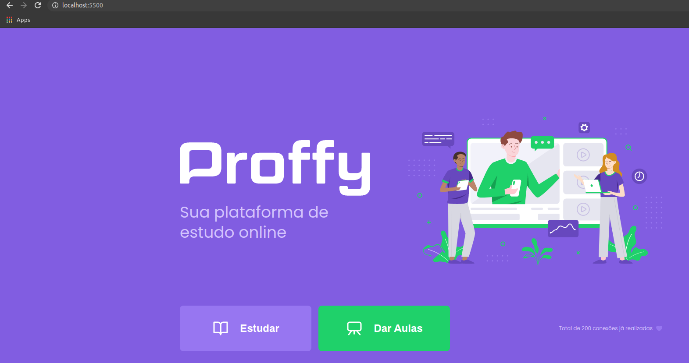
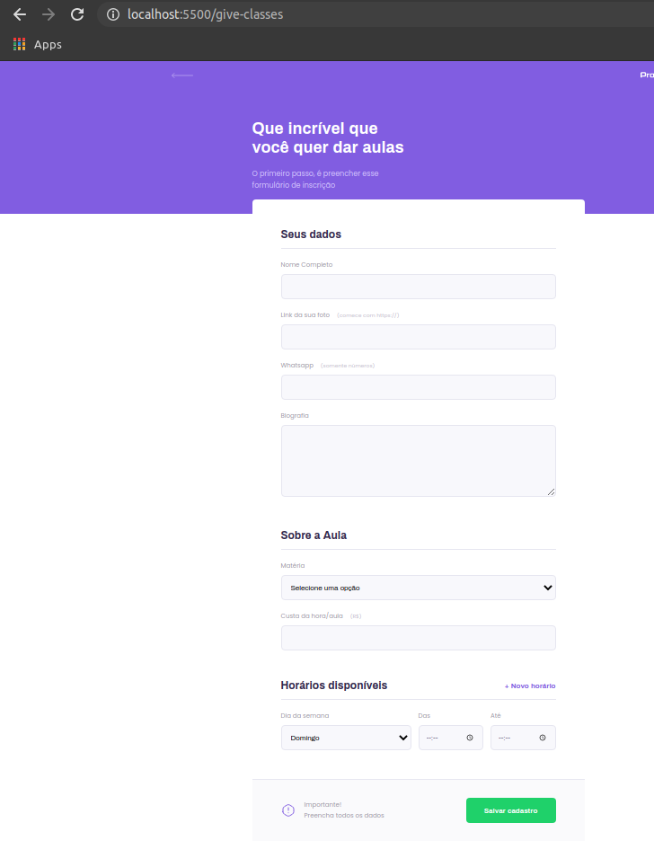
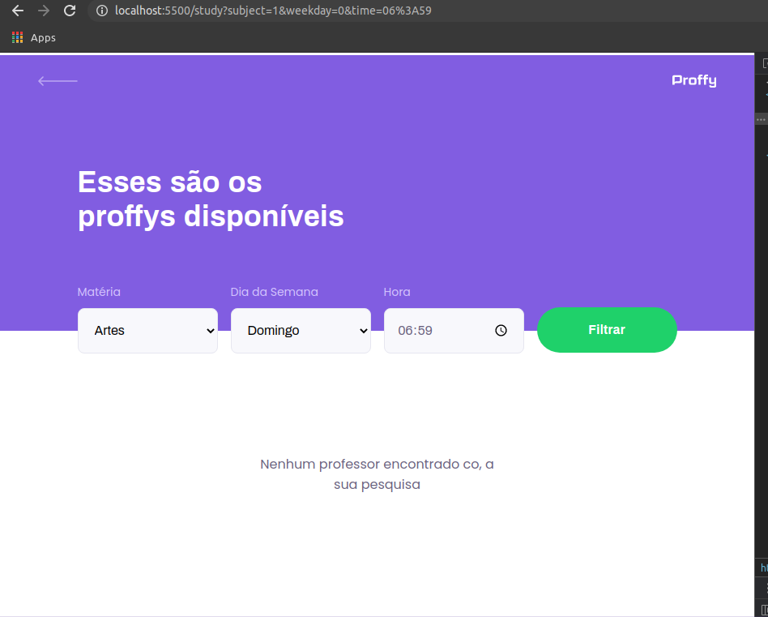

## Prints das telas desenvolvidas

<h1 align="center">
    
</h1>

<p align="center">
<span>


</span>
</p>

## 🔖 Sobre

O Proffy é uma aplicação Web e Mobile feita para auxiliar na conexão entre os alunos e os professores.

 Logo, esta aplicação oferece aos professores a possibilidade de registrar aulas, podendo adicionar informações como a disciplina,

  o custo e horário e aos alunos a possibilidade de buscar pelas aulas cadastradas.

Essa aplicação foi realizada durante a Next Level Week #2, projeto da Rocketseat.

---

# [I][n][d][i][c][e]

- [Sobre](#-sobre)
- [Tecnologias Utilizadas](#-tecnologias-utilizadas)
- [Como baixar o projeto](#-como-baixar-o-projeto)

---

## 🚀 Tecnologias utilizadas

O projeto foi desenvolvido utilizando as seguintes tecnologias

- [HTML](https://developer.mozilla.org/pt-BR/docs/Web/HTML)
- [JavaScript](https://developer.mozilla.org/pt-BR/docs/Aprender/JavaScript)
- [Node.Js](https://nodejs.org/en/)
- [Express](https://expressjs.com/)

---

## 🎓 Quem ministrou?

[Rocketseat](https://rocketseat.com.br/)

[Mayk Brito](https://github.com/maykbrito/maykbrito)


## 🗂 Como baixar o projeto

```bash

    # Clonar o repositório
    $ git clone https://github.com/CleytonPinheiro/nlw-proffy

    # Entrar no diretório
    $ na raiz do projeto

    #Subir o servidor local, digitando o comando:
    $ npm run dev

    # Iniciar o projeto
    $ abrir no navegador: localhost:5500
```

---

